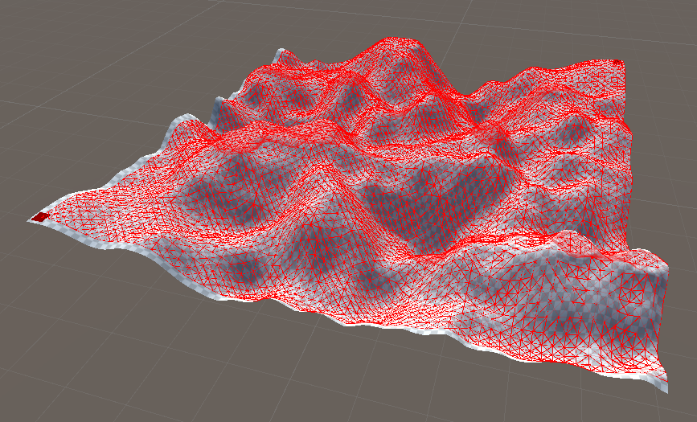
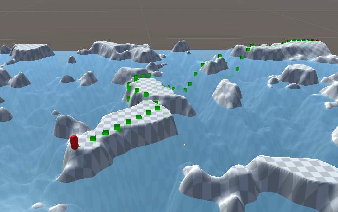

---
tags:
  - AIForVideoGames/Progetto
---
# Tidewalker
### Introduction
The following documentation follows the implementation of a project developed for the Artificial Intelligence for Video Games course held in Università Statale di Milano by professors Davide Gadia and Dario Maggiorini.
The project's goal was to create an Agent movement AI capable of traversing a procedurally generated Terrain with a specific set of constraints. It was to be developed in the Unity Engine, with the possibility of leveraging the codebase provided during the lectures.
#### Specification
The goal is to develop an Agent's AI behavior in Unity. The Agent has to traverse a procedurally generated Terrain from one corner to the opposite, while avoiding a body of water whose level is constantly rising and falling.
#### Constraints
Note: In the following constraints (and the rest of the documentation) the measurements are to be interpreted as Unity units, or units per second, which can be equivalent to meters.
- The Terrain has to be procedurally generated using Perlin noise to resemble a hill-shaped landscape. Its size must be 100x100 and its altitude go from -10 to +10. The start and end corners must be guaranteed to be above water level.
- The water level must rise and fall at a constant speed of 1.5 between a minimum an maximum level of -7.5 and 7.5.
- The Agent must move at a constant speed of 2 and can never stop. It must at all times stay above water level.
### Approaches considered
Before the final implementation was selected, other possible solutions to the problem were considered. These - while possibly suited for other situations - were deemed unfit to the constraints given, either theoretically or at testing time.
#### Movement behavior blending
Given the dual nature of the desired Agent movement behavior - to reach the destination and to avoid water - a behavior blending approach seemed at first like a natural solution.
However, the idea was quickly discarded because it clashed with two basic constraints: limited Agent movement speed and water avoidance.
Despite the water's movement being linear, its distance to the Agent is not: due to the slopes in the Terrain, a minimal change in water level could lead to a large area of the map getting submerged. Given the constant low speed of the agent, water avoidance in these occasions would prove very complex to guarantee.
To make this approach feasible, either the constant speed constraint on the Agent, or the complete avoidance of water condition would have to be relaxed.
#### Unity NavMesh
The problems of a "dynamic" movement approach like behavior blending can be avoided in a more "deterministic" pathfinding solution. If the Agent only moves along a safe path, guaranteed not to be in the water, it won't be submerged.
This solution was first implemented using Unity's NavMesh system, particularly its NavMesh Surface, NavMesh Agent and NavMesh Obstacle components:
- NavMesh Surface was assigned to the Terrain GameObject, to be baked as its procedural generation completes.
- NavMesh Agent was assigned to the Agent, with its parameters set up to respect the given constraints.
- NavMesh Obstacle was assigned to a Cube representing the body of water. `Carve` was enabled to "cut" into the NavMesh dynamically as it moved.
The resulting movement behavior aligned with the goal of the specification: the Agent would automatically perform pathfinding over the NavMesh, which was dynamically modified by the water, and move towards the destination set.
However, this solution presented problems when the Agent moved too close to the water: if the NavMesh Obstacle carved the portion of NavMesh the Agent was standing on, it would get instantly moved to the nearest point of the remaining NavMesh. This could be considered as a violation of the constraint on the constant speed of the Agent.
Due to the "black box" nature of Unity NavMesh, no solution was found to avoid this behavior, and this implementation was discarded. The intuition of finding a safe path, however, was at the basis of the final implementation. 
#### A* Pathfinding with water level prediction
The general idea of the NavMesh implementation was kept, but implemented from scratch to account for the specific constraints of the specification.
In the final implementation, pathfinding is executed via an A* algorithm modified to fit the situation: the heuristic prefers a path which leads through terrain that is always above water, and the water level is estimated at each step to exclude nonviable nodes from exploration.
The pathfinding yields a series of Nodes representing positions on the Terrain, which the Agent follows until the final destination is reached.
What follows is an in-depth description of this implementation.
### Implementation
The project's lifecycle is structured as follows:
1. **Perlin noise generation, Terrain and Pathfinding graph generation**
4. **Agent pathfinding** (Play Mode)
5. **Agent navigation** (Play Mode)
These functionalities are implemented in the following components:
- **PerlinTerrain**: MonoBehaviour responsible for Perlin noise generation and Terrain initialization.
- **TerrainGrid**: MonoBehaviour that generates a pathfinding Graph from a Terrain's data, for use in AStar.
- **Graph**, **Node**, **Edge**: Data structures used in pathfinding.
- **AStar**: Class that given a Graph, calculates a path fitting the project's scenario, and output it as a Stack of Nodes. It differs from standard A* in that it favors traversal of "safe Nodes", and prunes Nodes based on the predicted water level at the time of visit.
- **Agent**: MonoBehaviour that calls AStar on Start and handles Agent navigation along its Nodes during execution, using kinematic movement.
- **WaterLevel**: Simple MonoBehaviour to control the water's rising and falling movement.
#### Terrain and Graph generation
The initial Terrain and Graph generation is done before entering Play mode, by configuring the `PerlinTerrain` and `TerrainGrid` Components on the Terrain and Grid GameObjects.
Across the codebase, Terrain size is assumed to be 100x100 with maximum height of 20 (as per project specification), at a resolution of 513.
###### PelinTerrain
MonoBehaviour attached to Terrain. Resets or generates a new Terrain and `TerrainGrid` when the corresponding buttons in the Inspector are pressed.


Configurable parameters:
 - **Grid**: A reference to the `TerrainGrid` object to be initialized after Terrain generation.
 - **Base Heightmap Texture**: A gray-scale texture whose pixel \[0,1\] values are used as offset to be added to the final heightmap values.
 - **Sub-sampling**: The value at which to sample the Terrain for pathfinding Node creation. Range 32-256.
 - **Amplitude**: Value by which to amplify the base noise values. As these are in the \[0,1\] range, it results in overall altitude increase.
 - **Add harmonics**: Whether or not to add harmonics to noise generation.
 - **Random seed**: Seed used for noise generation. If 0, system current time is used.

The `PerlinTerrain` MonoBehaviour's functionality is triggered by pressing its Inspector buttons, which call either the `ResetTerrain` or `GenerateTerrain` methods. For ease of use, `GenerateTerrain` automatically calls `ResetTerrain` before generating a new Terrain.
`ResetTerrain` sets the Terrain's heights to an uninitialized matrix of floats, effectively flattening it.

`GenerateTerrain` first flattens the Terrain to discard previous changes to the Terrain asset, and proceeds to generate a random seed if one wasn't specified.
It calls the `PerlinNoise` method to generate a square float matrix the size of the Terrain's resolution, with the configured sub-sampling and amplitude. If harmonics are turned on, it generates two more matrices with the same methods, but sub-sampling and amplitude respectively scaled by 1/2 and 1/4. These matrices are then added together and the resulting values re-normalized.

`PerlinNoise` uses the standard Perlin Noise generation technique to generate a matrix of float values, and then applies normalization and amplitude scaling.
A `latticeValues` matrix is created and initialized to random values using `Random.insideUnitCircle`. The size of the matrix is given by `2 + Mathf.CeilToInt(outputResolution / subsampling)`. Adding 2 guarantees a minimum size for the following operations.
Each cell of the output matrix is populated by calculating the height contributions of the corresponding four neighbor points on the lattice, and applying bilinear interpolation with smoothstep on both axis.
In the same pass the maximum and minimum values are saved, and are then used in the following step which normalizes and applies amplitude scaling to the matrix.

After the final noise matrix is calculated, if a heightmap texture was specified its pixel gray-scale values are added per-cell. It is assumed that texture resolution equals heightmap resolution. This is done after normalization to guarantee that the additional height is added directly. In the context of the project, this allowed with the right texture to create two zones of max height in opposing corners of the Terrain.


Unity's Terrain allows to set its heights directly using a matrix of floats in the range \[0,1\], so no additional operations on it are needed. Terrain is then translated to be centered in the Scene.
Finally, a call is issued to `Grid` to build the pathfinding graph based on the generated Terrain's data.

###### TerrainGrid
MonoBehaviour attached to Grid. Automatically generates a Pathfinding Graph from the Terrain specified, with the option to visualize its Nodes and Edges using Gizmos.

Configurable parameters:
- **Show Pathfinding Nodes**: Whether to show Gizmos at Nodes positions.
- **Show Pathfinding Edges**: Whether to show Gizmos representing the edges in the Pathfinding Graph.
- **Terrain**: A reference to the Terrain GameObject from which to build the Pathfinding Graph.
- **Resolution**: Size of the square grid on which to base the Pathfinding Graph.
- **WaterLevel**: Reference to the Water GameObject Pathfinding will have to avoid.
- **Min Distance to Water**: Minimum Y distance to Water for a Node to be considered safe.
- **Start Node**: Indices where to place the Pathfinding start Node on the grid.
- **End Node** Indices where to place the Pathfinding end Node on the grid.

`TerrainGrid`'s functionality is triggered by calling its `Build` method, which in the context of this project is done in `PerlinTerrain` after Terrain generation. Its `Graph` output will be used by `Agent` for pathfinding.

`TerrainGrid` represents an intermediate step between the Terrain's data and the more abstract pathfinding `Graph`, and allows for easier rendering of related Gizmos.
It generates a matrix of the specified resolution and populates if with Nodes, which represent a position on the Terrain with additional data for pathfinding. Terrain position data is obtained by sampling its interpolated heights at the interval resulting from its size divided by the grid resolution. All positions are adjusted for the Terrain's translation.
References to the Nodes corresponding to the Start and End nodes configured are saved for use in `Agent`'s pathfinding, along with the minimum height at which a Node should be considered safe.

Each `Node` is added to a pathfinding `Graph`, and Edges are created to its neighboring nodes. Edge length is approximated as the Euclidean distance between two Nodes.


#### Pathfinding
Pathfinding utilizes `Graph` data initialized offline at Terrain generation time. It is then calculated in `Agent`'s `Start` method, right after entering Play Mode.
###### AStar
Class responsible for the actual pathfinding calculations, with a public static method `FindPath` that returns a Stack of Nodes representing the path, or `null` if none was found.
It implements a customized version of the A* algorithm, which takes into account safe Nodes and excludes unsafe Nodes based on the water level at their estimated time of arrival.

Input parameters:
- **graph**: The `Graph` on which to run A* on.
- **start**: The start Node.
- **end**: The end Node.
- **agentSpeed**: The speed at which the Agent will be traversing the path.
- **safetyDistance**: The minimum Y distance above the water level for which a Node is considered viable. 
- **maxWaterLevel**: The maximum level reached by the water.
- **waterSpeed**: The speed at which the water rises and falls.
- **maxExecutionTime**: Maximum execution time for the algorithm, after which pathfinding is aborted.

In this project's implementation, the `Node` and `Edge` data structures used in A* have the following structure:
- **Node**: In addition to the standard `position`, `previousNode`, `cost` and `heuristic` fields, an `eta` value has been added to represent the Estimated Time of Arrival of the Agent at that Node. It's used for water level prediction.
- **Edge**: In addition to the `to` and `from` Nodes fields, its `length` and `cost` values are made distinct, as to allow for custom Edge traversal cost while using its actual length for Node ETA prediction.


The heuristic used is simply the travel cost up to the selected `Node` plus its Euclidean distance to the End `Node`.
`AStar` exposes only the `FindPath` method, called by `Agent` in `Start` passing the required parameters.
`FindPath` implements the A* algorithm, with a few key adjustments to fit the project's scenario.
A* searches for a path on a graph by visiting its nodes in order of "promise", based on a heuristic to estimate which unvisited node is the best choice for the next step.

Execution starts with an initial setup of a timer to check execution time and with the initialization of the Start `Node`, whose `cost` and  `eta` are set to 0, and its `heuristic` calculated. All other `Nodes` have `cost`, `eta` and `heuristic` set to `float.MaxValue` by default in the `Node` constructor.

The algorithm then starts an execution loop that will return when a path to the End `Node` is found (it accepts the first viable path) or the execution timer runs out.
In each iteration of the loop, the unvisited `Node` with the most promising `heuristic` is explored. If its `cost` is still the default `float.MaxValue` it means that the `Node` is unreachable, and the method returns `null` indicating that no path was found.

Exploring a `Node` means checking the `Nodes` its edges point to, and connecting them in the tentative path if their previous cumulative `cost` to reach is worse than that from the current `Node`. That is always the case if it was never visited, or if the path through the current `Node` is better. In the latter case, it is added back to the list of Nodes to be visited, with its `cost`, `heuristic` and `previousNode` updated.
This step is also where the project's implementation of A* differs from the standard algorithm, with two key adjustments:
- **Node pruning**: For each explored `Node`, its `eta` is set at the cumulative time in milliseconds it took to reach it from the Start `Node`. `eta` is estimated by dividing the cumulative `length` of the edges traversed by the Agent's speed. Since the water's starting level, speed, and maximum level is known, it's possible to predict the height it will reach at `eta`with the following formula:
	```cs
 -maxWaterLevel + Mathf.PingPong(eta * waterSpeed, maxWaterLevel * 2)
	```
	If a `Node`'s Y position is not above the predicted water level by at least `safetyDistance`, it is not explored. This prevents the Agent from moving into an area that is predicted to be submerged by the time it reaches it.
- **Safe Nodes**: For each `Edge` explored, it's checked whether both the connected Nodes's height is above the maximum water level. If they are, the `cost` of travelling between them is set to ~0. This leads the Agent to prefer traversing areas that are guaranteed to be always above water, and to "stall" in safe zones until nearby unsafe Nodes emerge.

The resulting path Nodes are pushed into a Stack and passed to `Agent`.
In the event that no path was found (e.g. the end position is surrounded by Nodes always under water) or the timer runs out, `null` is returned.
#### Navigation
After pathfinding has returned a valid path the Agent traverses the Terrain following its Nodes, while the water level rises and falls.
###### Agent
MonoBehaviour attached to Agent. It's responsible for calling `AStar` with the data from `TerrainGrid` and `WaterLevel`, and to handle the navigation along its Nodes once a path is returned.

Configurable parameters:
- **Show path**: Whether to show Gizmos at path Nodes positions.
- **Fail Panel**: Reference to the UI Panel to show in case of failed pathfinding.
- **Terrain**: Reference to the Terrain to traverse.
- **Grid**: Reference to the `TerrainGrid` on which to run the pathfinding.
- **Water**: Reference to the Water to avoid.
- **Max Pathfinding Time**: Maximum pathfinding execution time after which it's to be considered failed.
- **Target Reached Radius**: Distance at which the Agent can consider a Node reached.
- **Speed**: The speed at which the Agent moves, intended as parallel to the Terrain surface.
- **Constraint to Terrain**: Whether to enforce that the transform should stay precisely on the Terrain surface.

`Agent` calls `AStar` in its `Start` method and follows the returned path in its `Update` method. It runs automatically once Play Mode is entered.

In `Start`, the Agent immediately calls `AStar` to get a safe path to the End `Node`. If it return `null` it means that pathfinding has failed, and the Fail Panel is shown.
Otherwise, `AStar` return a Stack of Nodes to be traversed, and `Agent` pops the first to set its Transform to its position. The next `Node` is popped as the first target to navigate to.



In `Update`, first the `Agent`'s position is checked to be within `_targetReachedRadius` of the current target: if it is, the next one gets popped from the Nodes Stack, or navigation ends if the target was the End `Node`.
Navigation is then handled, moving the `Agent`'s transform kinematically towards the target. `Agent` speed is multiplied by `Time.deltaTime` to ensure consistent movement across frames.

If `_constraintToTerrain` is enabled, the `Agent`'s Transform final Y value is then set as the height of the Terrain in that position, which requires that the `Agent`'s coordinates be translated and scaled to be relative to the Terrain.
This results in more realistic Terrain adherence, but the additional displacement along the Y axis may result in the `Agent` final speed not being constant. This, in turn, may lead to errors in `eta` prediction for pathfinding on rough terrain, although the delta should be minimal.
### Results and final considerations
The use of Perlin noise procedural generation combined with a predefined texture heightmap yields a wide variety of Terrain types, customizable via the exposed fields. The two corners of the map are consistently above water level, without affecting the rest of the Terrain in a way that would compromise its procedural nature.
It is to be noted that as-is, pathfinding often fails with noise `amplitude` lesser than 1.4, due to most of the map getting submerged when water level reaches its maximum.
Performance-wise, since Terrain and Graph generation is done offline, it has no bearing on real-time responsiveness.

Pathfinding performance varies from Terrain to Terrain, and is obviously dependent on pathfinding Grid resolution. Empirically, 64x64 on a 513x513 Terrain heightmap resolution seems like a good compromise between performance and Edges accuracy over Terrain slopes.
Still, successful pathfinding runs can vary heavily in timing, going from 7 to 300 milliseconds.
In rare occasions, for some Terrain configurations, it is possible for pathfinding calculations to freeze the Scene for seconds, which is why `Max Pathfinding Time` was introduced. This is due to the changing nature of the Graph, where a `Node` may be viable or not at different times of exploration.

In normal scenarios, pathfinding consistently returns viable paths to the End Node.
However, since water avoidance is based on an traversal time estimation, it's possible for its compounded error to lead to the water level prediction being wrong, and the path to contain Nodes that will be submerged at actual traversal time. This is exacerbated if the `Add harmonics` and `Constraint to Terrain` options are enabled, as they affect the displacement of the Agent in a way that's not reflected in the `AStar`'s linear movement prediction. This is mitigated by `Min Distance to Water`, but setting a minimum distance to water further restricts Nodes viability for the Agent, which may lead the algorithm to be too conservative and exclude path that are actually viable.